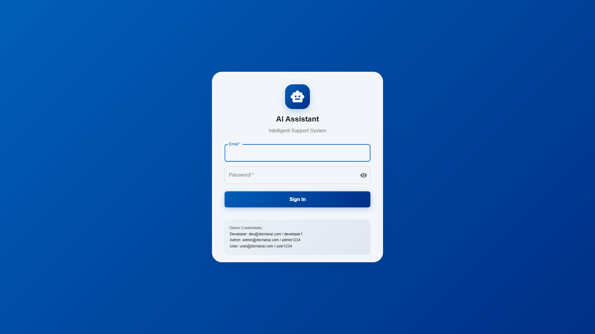
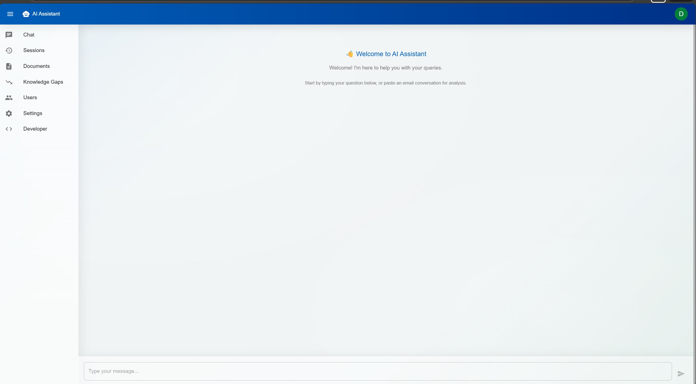
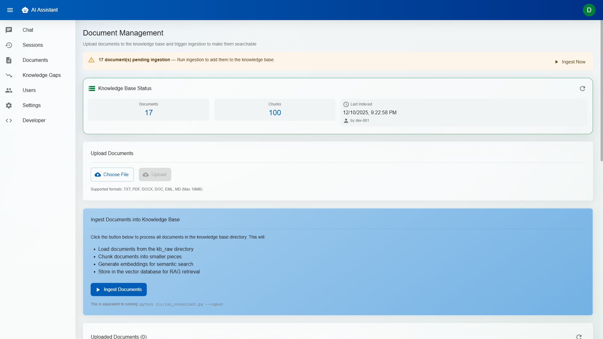
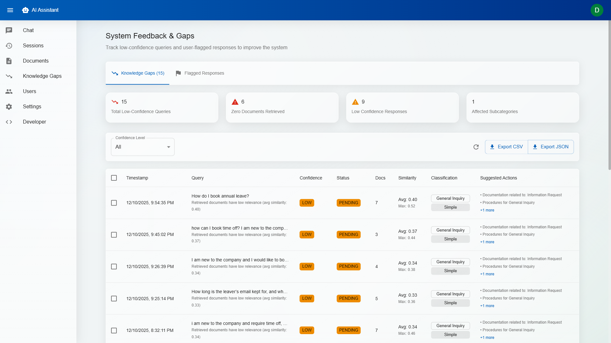
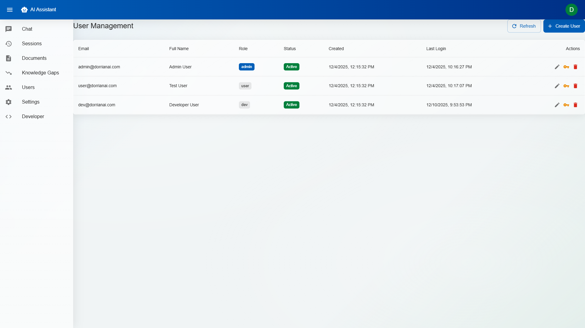
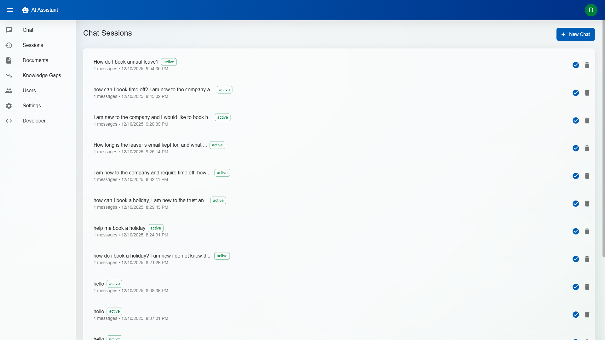
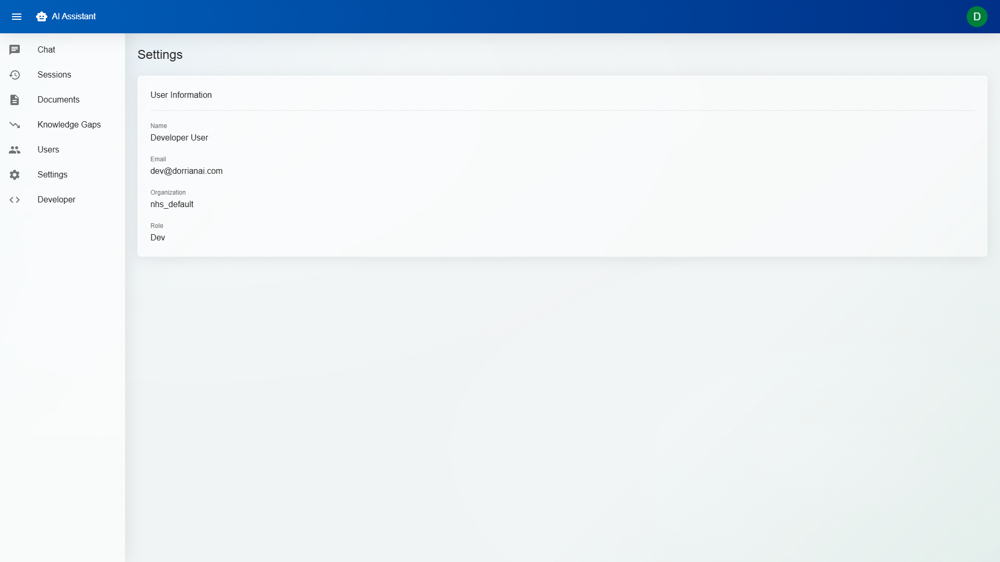
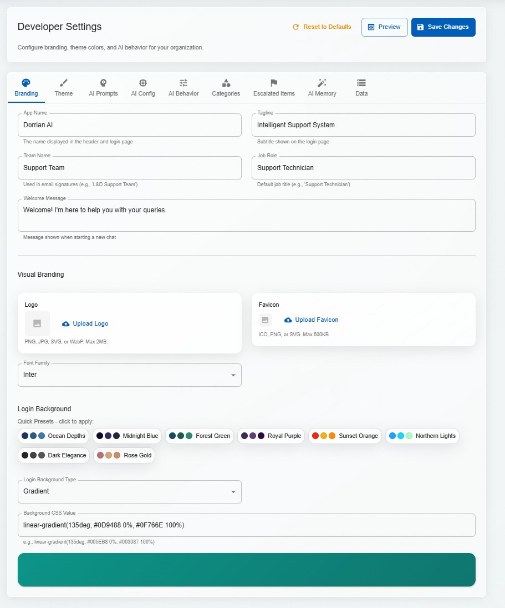
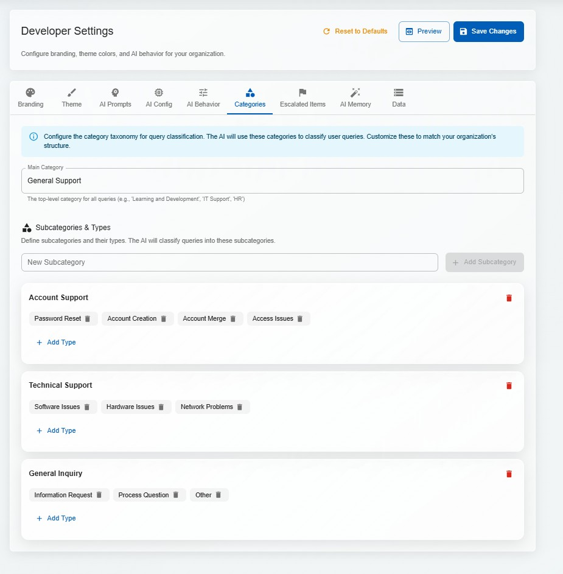

# DorrianAI - Enterprise AI Knowledge Assistant

<p align="center">
  
</p>

<p align="center">
  <strong>🤖 A white-label, local-first AI assistant that keeps your data private</strong>
</p>

<p align="center">
  <a href="#-the-problem">Problem</a> •
  <a href="#-my-solution">Solution</a> •
  <a href="#-features">Features</a> •
  <a href="#-skills-demonstrated">Skills</a> •
  <a href="#-tech-stack">Tech Stack</a> •
  <a href="#-screenshots">Screenshots</a> •
  <a href="#-technical-deep-dive">Deep Dive</a>
</p>

---

## 📋 TL;DR (for Recruiters & Hiring Managers)

> **DorrianAI** is a production-style, full-stack AI knowledge assistant I designed and built solo. It demonstrates real-world skills across the modern AI/SaaS stack.

| What | Details |
|------|---------|
| **Frontend** | React 18 + TypeScript, Material-UI, Zustand state management |
| **Backend** | FastAPI (Python), JWT authentication, 3-tier RBAC |
| **AI/RAG** | Custom 7-stage RAG pipeline, ChromaDB vector search, local LLMs via Ollama |
| **Cloud Option** | Azure OpenAI integration for cloud deployments |
| **Architecture** | Multi-tenant, white-label, fully configurable per organization |
| **Built By** | Solo developer – 15,000+ lines of code over 3 months |

> **📌 Note:** This repository is a documentation and demo showcase only. The production source code is private and not open-source.

---

## 🎯 The Problem

Organizations face a critical dilemma when implementing AI-powered support:

| Challenge | Impact |
|-----------|--------|
| **Data Privacy** | 78% of enterprises worry about sending data to cloud AI providers |
| **Compliance** | GDPR, HIPAA, SOC2 requirements make cloud AI complex |
| **Escalating Costs** | Cloud AI APIs charge $0.01-0.10 per query ($10k+/month at scale) |
| **Generic Solutions** | One-size-fits-all AI doesn't understand your organization |

---

## 💡 My Solution

**DorrianAI** is an enterprise-grade AI assistant I built from scratch that solves these problems:

| Feature | How It Works |
|---------|--------------|
| **100% Local** | Runs on your infrastructure - data never leaves your servers |
| **Zero AI Costs** | Uses Ollama (local LLM) - no per-query API fees |
| **Your Knowledge** | RAG system trained on YOUR documents, policies, and SOPs |
| **White-Label** | Fully customizable branding, colors, and AI personality |
| **Enterprise Ready** | JWT auth, 3-tier RBAC, multi-tenant architecture |

### 💡 Why This Matters (Impact)

- **Reduces repeat queries** – Staff find answers themselves instead of emailing support
- **Improves documentation quality** – Knowledge gaps auto-surface missing content
- **Builds institutional memory** – AI Memory captures tribal knowledge as explicit rules
- **Scales with zero marginal cost** – Local LLM means no per-query API fees at scale

### 🌐 Industry-Agnostic Design

The original implementation targeted **NHS / Learning & Development workflows**, but the architecture and RAG engine are fully **domain-agnostic**. The same codebase can be configured for:

- Healthcare operations & clinical support
- Public sector service desks
- SaaS customer success teams
- HR/IT internal helpdesks
- Any organization with policy/SOP documentation

---

## ✨ Features

### 🤖 AI-Powered Support
- **RAG (Retrieval-Augmented Generation)** - AI responses grounded in your knowledge base
- **Email Chain Parsing** - Extracts the real issue from complex email threads
- **Confidence Scoring** - Transparency on how certain the AI is
- **Draft Email Generation** - One-click professional email responses
- **Context-Aware Questions** - Smart follow-ups based on query type (HR vs IT vs Training)

### 📊 Knowledge Management
- **Document Upload** - PDF, DOCX, TXT, EML support
- **Automatic Indexing** - ChromaDB vector store for semantic search
- **Knowledge Gap Detection** - Auto-logs queries the AI couldn't answer confidently
- **Flagged Response Review** - Users can flag incorrect AI responses for admin review

### 🎨 White-Label Branding
- **Custom Identity** - App name, logo, favicon, tagline
- **Theme System** - Presets + custom colors, fonts, backgrounds
- **AI Personality** - Configure system role, industry context, communication style
- **8 Background Presets** - Ocean Depths, Midnight Blue, Forest Green, and more

### 🔐 Enterprise Security
- **JWT Authentication** - Secure token-based login with refresh
- **3-Tier RBAC** - User → Admin → Developer permissions
- **Multi-Tenant** - Isolated data per organization
- **Local-First** - No external API calls required

### 🧠 AI Memory System
- **Persistent Instructions** - Custom rules the AI always follows
- **AI Refinement** - Let AI improve your instructions
- **Escalation Workflow** - Knowledge Gaps → Admin Review → AI Memory

> 📄 **For the full feature matrix by page** (Chat, Documents, Sessions, Knowledge Gaps, Users, Developer Settings, Security), see **[Full Feature List](FEATURES.md)**.

---

## 🎓 Skills Demonstrated

This project showcases expertise across the full AI/SaaS development stack:

### Full-Stack Development
| Skill | Implementation |
|-------|----------------|
| React 18 | Functional components, hooks, context |
| TypeScript | Strict typing, interfaces, generics |
| State Management | Zustand stores with persistence |
| API Design | RESTful endpoints with OpenAPI docs |
| Authentication | JWT with refresh tokens, bcrypt hashing |

### AI/ML Engineering
| Skill | Implementation |
|-------|----------------|
| RAG Pipeline | Custom 7-stage retrieval-augmented generation |
| Vector Search | ChromaDB with similarity thresholds |
| Embeddings | sentence-transformers (384-dim vectors) |
| Prompt Engineering | Category-aware, context-injected prompts |
| Confidence Scoring | Multi-factor scoring with gap detection |
| Intent Classification | AI-powered conversational routing |

### Enterprise Architecture
| Skill | Implementation |
|-------|----------------|
| Multi-Tenancy | Isolated data directories per tenant |
| RBAC | 3-tier role hierarchy with route guards |
| White-Label | Full branding customization (name, logo, colors, AI personality) |
| Rate Limiting | Request throttling middleware |
| Error Handling | Graceful failures with user-friendly messages |

### DevOps & Best Practices
| Skill | Implementation |
|-------|----------------|
| Docker | Multi-stage builds for production |
| Git | Feature branches, semantic commits |
| Testing | Unit tests, stress tests, edge cases |
| Documentation | API docs, code comments, guides |
| Local-First | Runs entirely offline with Ollama |

---

## 🛠️ Tech Stack

### Frontend
| Technology | Purpose |
|------------|---------|
| **React 18** | Modern UI with hooks |
| **TypeScript** | Type-safe development |
| **Material-UI (MUI)** | Component library with theming |
| **Zustand** | Lightweight state management |
| **Vite** | Fast build and HMR |

### Backend
| Technology | Purpose |
|------------|---------|
| **FastAPI** | High-performance async API |
| **Pydantic v2** | Request/response validation |
| **SQLite** | User, session, and config storage |
| **JWT + bcrypt** | Secure authentication |

### AI/ML
| Technology | Purpose |
|------------|---------|
| **Ollama** | Local LLM runtime (Qwen, Llama, etc.) |
| **Azure OpenAI** | Optional cloud LLM provider |
| **ChromaDB** | Vector store for semantic search |
| **sentence-transformers** | Local embedding generation |

### Deployment Options

DorrianAI supports flexible deployment to match your security and infrastructure requirements:

| Option | Stack | Use Case |
|--------|-------|----------|
| **Local / On-Prem** | Ollama + local models, SQLite, ChromaDB | Maximum privacy, zero cloud dependency |
| **Azure Cloud** | Azure OpenAI, Azure Blob Storage, Azure SQL | Enterprise scale, managed infrastructure |
| **Hybrid** | Local embeddings + cloud LLM, or vice versa | Balance of privacy and capability |

---

## 📸 Screenshots

### Authentication & Onboarding

| Screenshot | Description |
|------------|-------------|
|  | **Login Page** - Glassmorphism design with custom branding, gradient button, dynamic theming |

### AI Chat Experience

| Screenshot | Description |
|------------|-------------|
|  | **Chat Interface** - Clean starting point for new conversations |
|  | **AI Response** - Confidence badge, category, next steps, source citations |
|  | **Flag Response** - Users can flag incorrect AI responses |
|  | **Flag Confirmation** - Feedback submitted for admin review |
|  | **Draft Email Modal** - One-click professional email generation |
|  | **Draft Email Preview** - Ready to copy and send |

### Knowledge Base Management

| Screenshot | Description |
|------------|-------------|
|  | **Documents Page** - Upload, preview, and manage knowledge base |

### Admin Features

| Screenshot | Description |
|------------|-------------|
|  | **Knowledge Gaps** - Auto-logged low-confidence queries |
|  | **User Management** - Create, edit, assign roles |
|  | **Sessions** - View and manage chat history |
|  | **Settings** - User preferences and configuration |

### Developer Settings (7 Tabs)

| Screenshot | Description |
|------------|-------------|
|  | **Branding Tab** - App name, logo, tagline customization |
|  | **Theme Tab** - Colors, fonts, 8 background presets |
|  | **AI Prompts** - System role, personality, industry context |
|  | **AI Config** - Model selection, temperature, retrieval settings |
|  | **AI Behavior** - Response style, confidence thresholds |
|  | **Escalated Items** - Flagged responses for developer review |
|  | **AI Memory** - Persistent custom instructions |
|  | **Categories** - Organize knowledge by department |
|  | **Data Storage** - Database and storage configuration |

---

## 🔬 Technical Deep Dive

### Project Structure

```
DorrianAI/
├── backend/                    # FastAPI REST API
│   ├── api/
│   │   ├── core/              # Config, security, middleware
│   │   │   ├── config.py      # Pydantic settings management
│   │   │   ├── security.py    # JWT auth, password hashing, RBAC
│   │   │   ├── db.py          # SQLite database setup
│   │   │   └── rate_limiter.py
│   │   ├── routers/           # API endpoints (11 modules)
│   │   │   ├── auth.py        # Login, register, refresh tokens
│   │   │   ├── chat.py        # RAG-powered AI responses
│   │   │   ├── documents.py   # Upload, index, preview
│   │   │   ├── sessions.py    # Chat session management
│   │   │   ├── feedback.py    # Knowledge gaps, flagged responses
│   │   │   ├── users.py       # User CRUD, role management
│   │   │   ├── branding.py    # White-label configuration
│   │   │   ├── ai_memory.py   # Persistent AI instructions
│   │   │   └── system.py      # Storage, categories, config
│   │   ├── models/            # Pydantic request/response schemas
│   │   └── services/          # Business logic layer (8 services)
│   └── data/                  # SQLite DBs, tenant data, uploads
│
├── frontend/                   # React TypeScript SPA
│   └── src/
│       ├── pages/             # 8 main pages
│       │   ├── LoginPage.tsx
│       │   ├── ChatPage.tsx
│       │   ├── SessionsPage.tsx
│       │   ├── DocumentsPage.tsx
│       │   ├── KnowledgeGapsPage.tsx
│       │   ├── UsersPage.tsx
│       │   ├── SettingsPage.tsx
│       │   └── DevPage.tsx    # 7-tab developer settings
│       ├── components/        # Reusable UI components
│       ├── services/          # API client layer (9 services)
│       ├── store/             # Zustand state management
│       └── types/             # TypeScript interfaces
│
└── src/nhs_ai_assistant/       # Core AI/RAG Library
    ├── rag/                   # RAG pipeline components
    │   ├── consultant.py      # Main orchestrator
    │   ├── retriever.py       # Vector search
    │   ├── confidence_scorer.py
    │   ├── intent_classifier.py
    │   ├── email_parser.py
    │   └── feedback_logger.py
    ├── embeddings/            # Embedding models
    ├── vectorstore/           # ChromaDB integration
    ├── llm/                   # LLM providers (Ollama, Azure)
    └── ingest/                # Document processing
```

---

### API Endpoints (40+)

| Category | Endpoint | Method | Description |
|----------|----------|--------|-------------|
| **Auth** | `/api/auth/login` | POST | JWT token authentication |
| | `/api/auth/register` | POST | User registration |
| | `/api/auth/refresh` | POST | Refresh access token |
| | `/api/auth/me` | GET | Current user profile |
| **Chat** | `/api/chat/query` | POST | RAG-powered AI response |
| | `/api/chat/parse-email` | POST | Email chain parsing |
| | `/api/chat/history/{id}` | GET | Chat history |
| | `/api/chat/draft-email` | POST | Generate email draft |
| **Sessions** | `/api/sessions/create` | POST | Create chat session |
| | `/api/sessions/list` | GET | List user sessions |
| | `/api/sessions/{id}` | DELETE | Delete session |
| | `/api/sessions/{id}/close` | POST | Close with resolution |
| **Documents** | `/api/documents/upload` | POST | Upload document |
| | `/api/documents/list` | GET | List documents |
| | `/api/documents/ingest` | POST | Index to vector store |
| | `/api/documents/{id}/preview` | GET | Preview content |
| **Feedback** | `/api/feedback/knowledge-gaps` | GET | Low-confidence queries |
| | `/api/feedback/flag` | POST | Flag incorrect response |
| | `/api/feedback/flagged` | GET | List flagged responses |
| | `/api/feedback/escalate` | POST | Escalate to developer |
| **Branding** | `/api/branding` | GET | Get tenant branding |
| | `/api/branding` | PATCH | Update branding |
| | `/api/branding/logo` | POST | Upload custom logo |
| **AI Memory** | `/api/ai-memory/instructions` | GET | Get AI instructions |
| | `/api/ai-memory/instructions` | POST | Add instruction |
| | `/api/ai-memory/refine` | POST | AI-assisted refinement |

---

### TypeScript Interfaces

```typescript
// AI Response Structure
interface ChatResponse {
  message_id: string;
  session_id: string;
  query: string;
  response: string;
  classification: 'Simple' | 'Moderate' | 'Complex';
  confidence_score: number;      // 0.0 - 1.0
  context_used?: string;         // RAG context
  sources?: string[];            // Document citations
  timestamp: string;
  processing_time_ms?: number;
  metadata?: {
    category: string;
    subcategory: string;
    clarifying_questions?: string[];
    next_steps?: string;
    email_draft?: string;
  };
}

// User with RBAC
interface User {
  id: string;
  email: string;
  full_name: string;
  tenant_id: string;
  role: 'user' | 'admin' | 'dev';
  is_active: boolean;
  permissions: string[];
  created_at: string;
  last_login?: string;
}

// Knowledge Gap Detection
interface KnowledgeGap {
  id: string;
  query: string;
  confidence_score: number;
  category: string;
  suggested_action: string;
  status: 'pending' | 'reviewed' | 'resolved' | 'escalated';
  admin_notes?: string;
  created_at: string;
}

// White-Label Branding
interface BrandingConfig {
  app_name: string;
  tagline: string;
  logo_url?: string;
  favicon_url?: string;
  theme: {
    primary_color: string;
    secondary_color: string;
    background_preset: string;
    font_family: string;
  };
  prompts: {
    system_role: string;
    industry_context: string;
    personality: string;
  };
}
```

---

### RAG Pipeline Architecture

```
┌─────────────────────────────────────────────────────────────────────┐
│                        USER QUERY                                    │
│  "How do I book annual leave if my manager is on holiday?"          │
└────────────────────────────────┬────────────────────────────────────┘
                                 │
                                 ▼
┌─────────────────────────────────────────────────────────────────────┐
│                    1. INTENT CLASSIFIER                              │
│  ┌─────────────────────────────────────────────────────────────┐    │
│  │ • AI-powered classification using LLM                       │    │
│  │ • Detects: greeting, question, complaint, escalation        │    │
│  │ • Conversational intents bypass RAG (direct response)       │    │
│  └─────────────────────────────────────────────────────────────┘    │
└────────────────────────────────┬────────────────────────────────────┘
                                 │ question detected
                                 ▼
┌─────────────────────────────────────────────────────────────────────┐
│                    2. DOCUMENT RETRIEVER                             │
│  ┌─────────────────────────────────────────────────────────────┐    │
│  │ Query → Embedding (all-MiniLM-L6-v2) → Vector Search        │    │
│  │                                                              │    │
│  │ ChromaDB returns top-k similar documents:                    │    │
│  │ • "Annual Leave Policy.pdf" (score: 0.89)                   │    │
│  │ • "Manager Absence Procedures.docx" (score: 0.76)           │    │
│  │ • "HR Self-Service Guide.txt" (score: 0.71)                 │    │
│  └─────────────────────────────────────────────────────────────┘    │
└────────────────────────────────┬────────────────────────────────────┘
                                 │
                                 ▼
┌─────────────────────────────────────────────────────────────────────┐
│                    3. CONFIDENCE SCORER                              │
│  ┌─────────────────────────────────────────────────────────────┐    │
│  │ Calculates confidence based on:                              │    │
│  │ • Similarity scores (weighted average)                       │    │
│  │ • Document relevance to query                                │    │
│  │ • Coverage of query terms                                    │    │
│  │                                                              │    │
│  │ Result: HIGH (0.85) - Documents directly answer query       │    │
│  └─────────────────────────────────────────────────────────────┘    │
└────────────────────────────────┬────────────────────────────────────┘
                                 │
                                 ▼
┌─────────────────────────────────────────────────────────────────────┐
│                    4. PROMPT CONSTRUCTOR                             │
│  ┌─────────────────────────────────────────────────────────────┐    │
│  │ Builds context-aware prompt with:                            │    │
│  │ • System role (from AI Prompts config)                      │    │
│  │ • AI Memory instructions (persistent rules)                  │    │
│  │ • Retrieved document context                                 │    │
│  │ • Session conversation history                               │    │
│  │ • Confidence level guidance                                  │    │
│  │ • AI Behavior settings (questions, style, escalation)       │    │
│  └─────────────────────────────────────────────────────────────┘    │
└────────────────────────────────┬────────────────────────────────────┘
                                 │
                                 ▼
┌─────────────────────────────────────────────────────────────────────┐
│                    5. LLM GENERATION                                 │
│  ┌─────────────────────────────────────────────────────────────┐    │
│  │ Ollama (local) or Azure OpenAI (cloud)                      │    │
│  │                                                              │    │
│  │ Model: qwen2.5-coder:7b (structured JSON output)            │    │
│  │ Temperature: 0.7                                             │    │
│  │ Max tokens: 1500                                             │    │
│  └─────────────────────────────────────────────────────────────┘    │
└────────────────────────────────┬────────────────────────────────────┘
                                 │
                                 ▼
┌─────────────────────────────────────────────────────────────────────┐
│                    6. RESPONSE PARSER                                │
│  ┌─────────────────────────────────────────────────────────────┐    │
│  │ Structured JSON output:                                      │    │
│  │ {                                                            │    │
│  │   "category": "HR",                                         │    │
│  │   "subcategory": "Leave & Absence",                         │    │
│  │   "complexity": "Simple",                                   │    │
│  │   "next_steps": "1. Log into ESR Self-Service...",         │    │
│  │   "clarifying_questions": [],                               │    │
│  │   "email_draft": null                                       │    │
│  │ }                                                            │    │
│  └─────────────────────────────────────────────────────────────┘    │
└────────────────────────────────┬────────────────────────────────────┘
                                 │
                                 ▼
┌─────────────────────────────────────────────────────────────────────┐
│                    7. FEEDBACK LOGGER                                │
│  ┌─────────────────────────────────────────────────────────────┐    │
│  │ If confidence < threshold:                                   │    │
│  │ • Log to knowledge_gaps.jsonl                               │    │
│  │ • Flag for admin review                                      │    │
│  │ • Suggest documentation to add                               │    │
│  └─────────────────────────────────────────────────────────────┘    │
└─────────────────────────────────────────────────────────────────────┘
```

---

### Challenges & Solutions

During development, I encountered and solved several significant technical challenges:

#### 1. Email Chain Parsing Accuracy

**Problem:** Initial email parser was extracting the wrong query from complex email chains with multiple replies, forwards, and CC'd participants.

**Solution:** Built a sophisticated parser that:
- Identifies the original issue by traversing the chain bottom-up
- Extracts context (error messages, troubleshooting steps tried, deadlines)
- Correctly attributes users from "From:" headers
- Handles edge cases: HTML formatting, emojis, missing headers

```python
# Key insight: Find original issue, not latest reply
def _find_original_issue(self, email_blocks: List[str]) -> str:
    """
    Traverse email chain to find the original query.
    The actual issue is usually in the FIRST email, not the latest.
    """
    # Parse in reverse chronological order
    # Look for question patterns, error messages, requests
```

#### 2. RAG Confidence Scoring

**Problem:** AI was responding confidently even when documents didn't contain relevant information, leading to hallucinated answers.

**Solution:** Implemented multi-factor confidence scoring:
- Weighted average of similarity scores
- Query term coverage analysis
- Automatic knowledge gap logging when confidence < threshold
- UI displays confidence badges so users know when to verify

#### 3. Context-Aware Clarifying Questions

**Problem:** AI was asking generic questions regardless of context. For HR queries, it would ask IT troubleshooting questions.

**Solution:** Category-aware prompt construction:
```python
# Different question logic per category
if category == "HR":
    # Ask about employee details, dates, leave types
elif category == "IT":
    # Ask about error messages, systems, troubleshooting steps
elif category == "Training":
    # Ask about course names, deadlines, access issues
```

#### 4. White-Label Theme Persistence

**Problem:** Theme changes weren't persisting across page refreshes, and dynamic CSS variable injection was causing FOUC (Flash of Unstyled Content).

**Solution:**
- Store theme in both localStorage and backend database
- Load theme in BrandingProvider before first render
- Inject CSS variables at document root level
- 8 carefully designed gradient presets for instant professional looks

#### 5. Multi-Turn Conversation Context

**Problem:** AI was losing context in multi-turn conversations, asking for information already provided.

**Solution:**
- Session manager tracks full conversation history
- Prompt includes summarized context from previous turns
- AI explicitly instructed not to re-ask for provided information

---

## 🏗️ Architecture

```
┌─────────────────────────────────────────────────────────────┐
│                   React Frontend (PWA)                      │
│  ├─ Material-UI + Glassmorphism Design                     │
│  ├─ TypeScript + Zustand State Management                   │
│  └─ Dynamic Theming System                                  │
└────────────────────────┬────────────────────────────────────┘
                         │ REST API (JWT Auth)
                         ▼
┌─────────────────────────────────────────────────────────────┐
│                   FastAPI Backend                           │
│  ├─ JWT Authentication + 3-Tier RBAC                       │
│  ├─ Multi-tenant Session Management                         │
│  ├─ White-label Branding System                             │
│  └─ Document Processing Pipeline                            │
└────────────────────────┬────────────────────────────────────┘
                         │
                         ▼
┌─────────────────────────────────────────────────────────────┐
│              DorrianAI Core Engine                          │
│  ├─ RAG Pipeline (Semantic Search + Generation)            │
│  ├─ Email Parser (Chain Extraction)                        │
│  ├─ Confidence Scorer + Knowledge Gap Detection            │
│  └─ Intent Classifier                                       │
└────────────────────────┬────────────────────────────────────┘
                         │
                         ▼
┌─────────────────────────────────────────────────────────────┐
│              AI & Storage Layer                             │
│  ├─ Ollama (Local LLM) or Azure OpenAI                     │
│  ├─ ChromaDB (Vector Store)                                │
│  └─ SQLite (Users, Sessions, Config)                        │
└─────────────────────────────────────────────────────────────┘
```

---

## 📊 Project Metrics

| Category | Metric | Value |
|----------|--------|-------|
| **Frontend** | React Pages | 8 |
| | React Components | 15+ |
| | TypeScript Interfaces | 25+ |
| | Zustand Stores | 3 |
| | API Service Modules | 9 |
| **Backend** | API Routers | 11 |
| | API Endpoints | 40+ |
| | Service Classes | 8 |
| | Pydantic Models | 30+ |
| **RAG Engine** | Pipeline Components | 9 |
| | LLM Providers | 2 (Ollama, Azure) |
| | Embedding Models | 1 (all-MiniLM-L6-v2) |
| **Testing** | Stress Test Cases | 50+ |
| | Edge Case Scenarios | 15+ |
| **Overall** | Lines of Code | 15,000+ |
| | Git Commits | 100+ |
| | Development Time | 3 months |

---

## 👥 Role-Based Access

```
Developer (Full Access)
    ↓ inherits
Admin (Documents, Users, Knowledge Gaps)
    ↓ inherits
User (Chat, Sessions, Settings)
```

| Page | User | Admin | Developer |
|------|:----:|:-----:|:---------:|
| Chat | ✅ | ✅ | ✅ |
| Sessions | ✅ | ✅ | ✅ |
| Settings | ✅ | ✅ | ✅ |
| Documents | ❌ | ✅ | ✅ |
| Knowledge Gaps | ❌ | ✅ | ✅ |
| Users | ❌ | ✅ | ✅ |
| Developer (7 tabs) | ❌ | ❌ | ✅ |

---

## 🎥 Demo Video

> 📹 **[Watch the full demo on YouTube](#)** *(coming soon)*

---

## 🚧 Roadmap

### Completed ✅
- [x] Full-stack React + FastAPI application
- [x] RAG-based knowledge retrieval
- [x] JWT auth with 3-tier RBAC
- [x] White-label branding system
- [x] AI Memory (persistent instructions)
- [x] Knowledge gap detection
- [x] Azure OpenAI integration

### In Progress 🔄
- [ ] Dark mode toggle
- [ ] Real-time WebSocket updates
- [ ] Bulk document operations

### Planned 📋
- [ ] Microsoft Teams integration
- [ ] ServiceNow/JIRA connectors
- [ ] Analytics dashboard
- [ ] Docker Compose deployment
- [ ] Kubernetes helm charts

---

## 👤 About Me

I'm **Dorrian Sidwell**, a Data & AI engineer focused on building production-style AI assistants and automation. I work across the full stack—React/TypeScript on the frontend, FastAPI/Python on the backend, and RAG pipelines with local LLMs and Azure OpenAI.

I enjoy solving real business problems with AI, especially where privacy, multi-tenancy, and user experience all matter.

---

## 🎬 Live Demo Availability

I can run the full application locally and demonstrate it via screen-share during interviews. Recruiters and hiring managers are welcome to request a walkthrough.

📩 **Contact me to schedule a demo:**
- 💼 [LinkedIn](https://linkedin.com/in/dorriansidwell)
- 🐙 [GitHub](https://github.com/DorrianSidwell)
- 📧 [Email](soaddorrian@gmail.com)

---

## ⚠️ Repository Notice

This is a **documentation and demo showcase only**. The production application source code is private and not open-source.

Interested in a demo or collaboration? Feel free to reach out!

---

<p align="center">
  <strong>Built with ❤️ by Dorrian Sidwell</strong>
</p>

<p align="center">
  <em>A local-first AI assistant that respects your privacy while delivering enterprise results.</em>
</p>

<p align="center">
  <sub>© 2025 Dorrian Sidwell. All rights reserved. This repository is for portfolio/demo purposes only and may not be copied or redistributed without permission.</sub>
</p>
